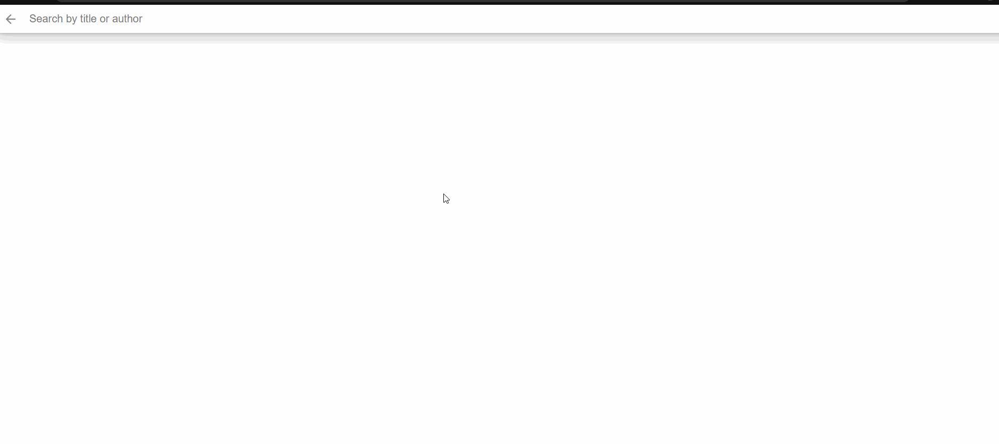
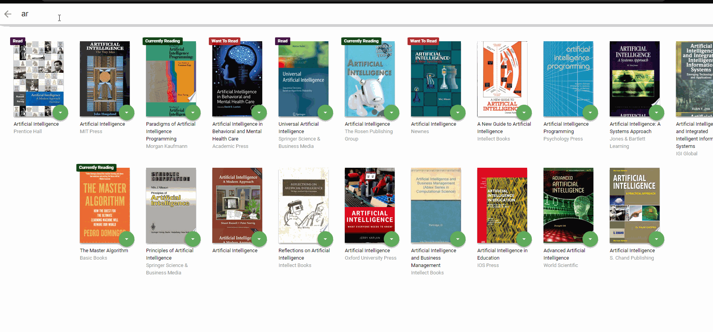
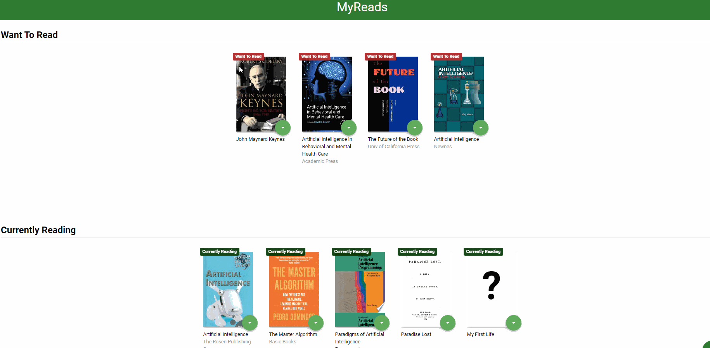

# MyReads App

- Final exam from Udacity's React Fundamentals course.

My Reads is a cataloging app that allows you to search for Books based on title or author and placing them in three different shelves (Want to Read, Currently Reading, Read).

It started out as a static HTML & CSS version. It was then refactored into 4 different components and also Javascript was added to achieve dynamic features.

Consult the **rubric** for specifics. (https://review.udacity.com/#!/rubrics/918/view)
  
## Getting Started  

 install all project dependencies with `npm install`
 start the development server with `npm start`

#Breakthrough

## BooksAPI 
###Search Terms

The backend API is limited to a controlled set of search terms, which are available in the SEARCH_TERMS.md file.

## React Components Hierarchy

``

    |----<BooksApp/>
          |----<ListBooksPerCategory />
          |     |
          |     |----<Book />
          |           |
          |           |----<BookShelfChanger.js  /> 
          |                  
          |     
          |----<Search />
                |
                |----<Book />
                      |
                      |----<BookShelfChanger.js  /> 

``

###Preview
*This is a preview of how the Search works.*

*This is a preview of how the Changing a books shelf looks on the Search page.*

*This is a preview of how the HomePage looks.*
